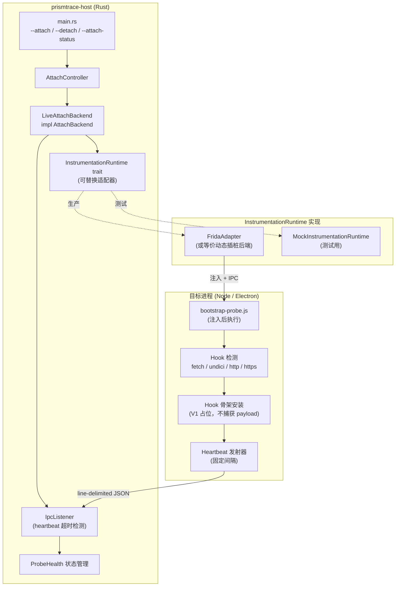

# Design Document: add-probe-bootstrap

## Overview

本 feature 是 PrismTrace 里程碑 2（实时附加原型）的收尾切片。目标是用真实的 `LiveAttachBackend` 替换现有的 `ScriptedAttachBackend`，完成从"结构化 attach 控制流"到"真正连接到目标进程"的闭环。

交付后，用户可以对一个 readiness 通过的 Node / Electron 进程执行真实 attach，看到 probe bootstrap 结果、heartbeat 通道建立、以及 `--detach` / `--attach-status` 命令面的完整输出。此阶段仍不捕获 request / response payload，但 probe 已在线并维持心跳。

### 核心变化摘要

| 变化点 | 当前状态 | 目标状态 |
|--------|----------|----------|
| Attach backend | `ScriptedAttachBackend`（预设结果） | `LiveAttachBackend`（真实插桩） |
| Probe | 无 | Bootstrap probe（JS，检测 + hook 骨架 + heartbeat） |
| IPC 通道 | 无 | 面向行 JSON，host 侧 `IpcListener` |
| Heartbeat 超时 | 无 | Host 检测超时并标记失联 |
| CLI 命令面 | `--attach <pid>` | 新增 `--detach`、`--attach-status` |
| ProbeHealth 可见性 | 无 | `--attach-status` 输出中包含 hook 摘要 |

---

## Architecture

### 高层系统图



### 关键设计决策

**D1: InstrumentationRuntime trait 隔离插桩后端**
`LiveAttachBackend` 不直接调用任何具体插桩 API，而是通过 `InstrumentationRuntime` trait 接入。这使得测试可以注入 `MockInstrumentationRuntime`，CI 无需真实目标进程。

**D2: IPC 通道使用面向行 JSON（newline-delimited JSON）**
V1 选择最简单的通信格式：每条消息是一行 JSON，包含 `type` 和 `timestamp` 字段。Host 侧用 `BufReader::lines()` 读取，probe 侧用 `process.stdout` 或 Unix socket 写入。

**D3: Heartbeat 超时在 Host 侧检测**
Probe 只负责发送心跳，Host 侧 `IpcListener` 维护最后一次心跳时间戳，超时后发出 `HeartbeatTimeout` 事件。这样 probe 保持无状态，超时策略可在 host 侧调整。

**D4: V1 只支持单 active session**
继承自 `attach-controller` 的约束，`AttachController` 在任意时刻只维护一个 active session。

**D5: Probe 不修改磁盘文件**
所有 hook 操作仅限运行时内存，不写入任何磁盘文件。

---

## Components and Interfaces

### 1. `InstrumentationRuntime` trait（新增，`prismtrace-host`）

```rust
/// 可替换的插桩运行时适配器。
/// 生产实现调用真实动态插桩后端；测试实现返回受控结果。
pub trait InstrumentationRuntime: Send + 'static {
    /// 附加到目标进程。成功返回一个不透明的 session handle。
    fn attach(&self, pid: u32) -> Result<RuntimeSessionHandle, InstrumentationError>;

    /// 向已附加的进程注入 bootstrap probe 脚本。
    /// 返回 IPC 通道的读端（实现为 BufRead）。
    fn inject_probe(
        &self,
        handle: &RuntimeSessionHandle,
        probe_script: &str,
    ) -> Result<Box<dyn BufRead + Send>, InstrumentationError>;

    /// 向目标进程发送 detach 信号（通过 IPC 或运行时 API）。
    fn detach(&self, handle: &RuntimeSessionHandle) -> Result<(), InstrumentationError>;
}

#[derive(Debug, Clone)]
pub struct RuntimeSessionHandle {
    pub pid: u32,
    pub runtime_id: String,
}

#[derive(Debug, Clone, PartialEq, Eq)]
pub struct InstrumentationError {
    pub kind: InstrumentationErrorKind,
    pub message: String,
}

#[derive(Debug, Clone, Copy, PartialEq, Eq)]
pub enum InstrumentationErrorKind {
    PermissionDenied,
    ProcessNotFound,
    RuntimeIncompatible,
    InjectionFailed,
    DetachFailed,
}
```

### 2. `LiveAttachBackend`（新增，`prismtrace-host/src/attach.rs`）

```rust
pub struct LiveAttachBackend<R: InstrumentationRuntime> {
    runtime: R,
    active_handle: Option<RuntimeSessionHandle>,
}

impl<R: InstrumentationRuntime> LiveAttachBackend<R> {
    pub fn new(runtime: R) -> Self { ... }
}

impl<R: InstrumentationRuntime> AttachBackend for LiveAttachBackend<R> {
    fn attach(&mut self, target: &ProcessTarget) -> Result<BackendAttachOutcome, AttachFailure> {
        // 1. runtime.attach(target.pid)
        // 2. runtime.inject_probe(handle, BOOTSTRAP_PROBE_SCRIPT)
        // 3. 从 IPC 读取第一条 bootstrap_complete 消息
        // 4. 解析 ProbeHealth，构造 BackendAttachOutcome { bootstrap: Ready, ... }
    }

    fn detach(&mut self, session: &AttachSession) -> Result<String, AttachFailure> {
        // 1. 通过 IPC 发送 detach 命令
        // 2. runtime.detach(handle)
        // 3. 清除 active_handle
    }
}
```

### 3. `IpcMessage`（新增，`prismtrace-host/src/ipc.rs`）

```rust
#[derive(Debug, Clone, PartialEq, Eq, Serialize, Deserialize)]
#[serde(tag = "type", rename_all = "snake_case")]
pub enum IpcMessage {
    BootstrapComplete {
        timestamp: u64,
        installed_hooks: Vec<String>,
        failed_hooks: Vec<String>,
    },
    Heartbeat {
        timestamp: u64,
    },
    HookInstalled {
        timestamp: u64,
        hook_name: String,
    },
    HookFailed {
        timestamp: u64,
        hook_name: String,
        reason: String,
    },
    DetachAck {
        timestamp: u64,
    },
}
```

### 4. `IpcListener`（新增，`prismtrace-host/src/ipc.rs`）

```rust
pub struct IpcListener {
    reader: Box<dyn BufRead + Send>,
    heartbeat_timeout: Duration,
    last_heartbeat: Instant,
}

pub enum IpcEvent {
    Message(IpcMessage),
    HeartbeatTimeout { elapsed_ms: u64 },
    ChannelDisconnected { reason: String },
}

impl IpcListener {
    pub fn new(reader: Box<dyn BufRead + Send>, heartbeat_timeout: Duration) -> Self { ... }

    /// 阻塞读取下一个事件。超时或断开时返回对应 IpcEvent。
    pub fn next_event(&mut self) -> IpcEvent { ... }

    /// 非阻塞检查心跳是否超时。
    pub fn check_heartbeat_timeout(&self) -> Option<IpcEvent> { ... }
}
```

### 5. Bootstrap Probe（新增，`probe/bootstrap.js`）

```javascript
// 入口：由 InstrumentationRuntime 注入后立即执行
(function bootstrapProbe(ipcSend) {
  const HEARTBEAT_INTERVAL_MS = 5000;

  // 1. 检测可用 hook 点
  function detectAvailableHooks(env) { ... }

  // 2. 安装 hook 骨架（V1 占位，不捕获 payload）
  function installHooks(available, ipcSend) { ... }

  // 3. 发送 bootstrap_complete
  // 4. 启动 heartbeat 定时器
  // 5. 监听 detach 命令
})
```

### 6. `ProbeHealthStore`（新增，`prismtrace-host/src/probe_health.rs`）

```rust
#[derive(Debug, Clone, PartialEq, Eq)]
pub struct ProbeHealthStore {
    pub health: Option<ProbeHealth>,
    pub last_heartbeat_at: Option<Instant>,
    pub session_state: ProbeSessionState,
}

#[derive(Debug, Clone, Copy, PartialEq, Eq)]
pub enum ProbeSessionState {
    Idle,
    Bootstrapping,
    Alive,
    TimedOut,
    Disconnected,
}

impl ProbeHealthStore {
    pub fn apply_event(&mut self, event: &IpcEvent) { ... }
    pub fn status_summary(&self) -> String { ... }
}
```

### 7. CLI 命令面扩展（`prismtrace-host/src/main.rs`）

新增两个 CLI 标志：

```
--detach                  结束当前 active attach session
--attach-status           查询当前 attach 状态（只读）
```

`collect_attach_snapshot` 扩展为接受 `LiveAttachBackend`；新增 `collect_detach_snapshot` 和 `collect_attach_status_snapshot`。

---

## Data Models

### IPC 消息格式（面向行 JSON）

每条消息是一行 JSON，以 `\n` 结尾：

```json
{"type":"bootstrap_complete","timestamp":1714000000000,"installed_hooks":["fetch","undici"],"failed_hooks":["http"]}
{"type":"heartbeat","timestamp":1714000005000}
{"type":"detach_ack","timestamp":1714000010000}
```

字段约束：
- `type`：枚举字符串，snake_case
- `timestamp`：Unix 毫秒时间戳，`u64`
- 所有字段名 snake_case

### `ProbeHealth`（已在 `prismtrace-core` 定义，本 feature 填充语义）

```rust
pub struct ProbeHealth {
    pub state: ProbeState,           // Attached / Failed / Detached
    pub installed_hooks: Vec<String>, // ["fetch", "undici"]
    pub failed_hooks: Vec<String>,    // ["http"]
}
```

### `AttachStatusSnapshot`（新增，`prismtrace-host/src/lib.rs`）

```rust
pub struct AttachStatusSnapshot {
    pub summary: String,
    pub active_session: Option<AttachSession>,
    pub probe_health: Option<ProbeHealth>,
    pub probe_session_state: ProbeSessionState,
}
```

### `DetachSnapshot`（新增，`prismtrace-host/src/lib.rs`）

```rust
pub struct DetachSnapshot {
    pub summary: String,
    pub detach_result: Result<AttachSession, AttachFailure>,
}
```

### Hook 名称常量

V1 支持的 hook 点：

```
"fetch"    - 全局 fetch API
"undici"   - undici 库
"http"     - Node http 模块
"https"    - Node https 模块
```

---

## Correctness Properties

*A property is a characteristic or behavior that should hold true across all valid executions of a system — essentially, a formal statement about what the system should do. Properties serve as the bridge between human-readable specifications and machine-verifiable correctness guarantees.*

### Property 1: Inject-then-Ready

*For any* `ProcessTarget` where the mock `InstrumentationRuntime` returns inject success, `LiveAttachBackend::attach` SHALL return a `BackendAttachOutcome` with `bootstrap.state == ProbeBootstrapState::Ready`.

**Validates: Requirements 1.2, 1.3**

---

### Property 2: Failure Propagation

*For any* error variant returned by the mock `InstrumentationRuntime` (permission denied, process not found, injection failed), `LiveAttachBackend::attach` SHALL return an `AttachFailure` with a non-empty `reason` string, and SHALL NOT panic.

**Validates: Requirements 1.4**

---

### Property 3: Hook Detection Matches Availability

*For any* subset of `{fetch, undici, http, https}` marked as available in the mock runtime environment, after bootstrap completes, `installed_hooks` SHALL contain exactly those hooks that were both available and successfully installed.

**Validates: Requirements 2.1, 2.2**

---

### Property 4: Partial Failure Resilience

*For any* partition of hooks into `(failing_hooks, succeeding_hooks)`, after bootstrap completes: `installed_hooks` SHALL contain all hooks in `succeeding_hooks` and SHALL NOT contain any hook in `failing_hooks`.

**Validates: Requirements 2.4**

---

### Property 5: Hook Installation Idempotence

*For any* hook name, installing it twice SHALL produce the same `installed_hooks` count as installing it once — no duplicate entries, no side effects.

**Validates: Requirements 2.5**

---

### Property 6: IPC Message Round-Trip

*For any* `IpcMessage` variant, serializing it to a newline-delimited JSON string and deserializing it back SHALL produce an equivalent message with the same `type` and `timestamp` fields preserved.

**Validates: Requirements 3.4**

---

### Property 7: Heartbeat Timeout Detection

*For any* configured `heartbeat_timeout` duration, if no `Heartbeat` message arrives within that window after the last heartbeat, `IpcListener::check_heartbeat_timeout` SHALL return a `HeartbeatTimeout` event.

**Validates: Requirements 3.3**

---

### Property 8: Channel Disconnect Safety

*For any* IO error returned by the underlying IPC reader, `IpcListener::next_event` SHALL return a `ChannelDisconnected` event and SHALL NOT propagate the error as a panic or unhandled `Result::Err`.

**Validates: Requirements 3.5**

---

### Property 9: Status Report Completeness

*For any* `AttachSession` and `ProbeHealth`, `attach_status_report` SHALL produce a string containing: the target pid, the session state label, the count of installed hooks, and each name in `failed_hooks`.

**Validates: Requirements 4.2, 4.4, 6.1**

---

### Property 10: Status Report Idempotence

*For any* `AttachStatusSnapshot`, calling `attach_status_report` N times SHALL leave the session state and `ProbeHealth` unchanged — the operation is purely read-only.

**Validates: Requirements 6.4**

---

### Property 11: State Machine Consistency

*For any* valid sequence of operations `(attach → heartbeat_received → detach)` executed against a mock `InstrumentationRuntime`, the `AttachController` session state SHALL transition through exactly: `None → Attached → Detached`, with no intermediate `Failed` state.

**Validates: Requirements 7.2, 7.4**

---

### Property 12: Probe Detach Removes All Hooks

*For any* set of installed hooks, after the probe receives a detach signal, `installed_hooks` SHALL be empty — all hooks are removed and the runtime is restored to its pre-attach state.

**Validates: Requirements 5.5**

---

### Property 13: Detach Report Format

*For any* successfully detached `AttachSession`, `detach_report` SHALL produce a string containing `"[detached]"` and the target pid.

**Validates: Requirements 5.2**

---

## Error Handling

### 错误分类与处理策略

| 错误场景 | 错误类型 | 处理策略 |
|----------|----------|----------|
| 目标进程不存在 | `InstrumentationError { kind: ProcessNotFound }` | 转换为 `AttachFailure { kind: BackendRejected }` |
| 权限拒绝 | `InstrumentationError { kind: PermissionDenied }` | 转换为 `AttachFailure { kind: BackendRejected }`，reason 包含 "permission denied" |
| 运行时不兼容 | `InstrumentationError { kind: RuntimeIncompatible }` | 转换为 `AttachFailure { kind: HandshakeFailed }` |
| Probe 注入失败 | `InstrumentationError { kind: InjectionFailed }` | 转换为 `AttachFailure { kind: HandshakeFailed }` |
| Bootstrap 超时（未收到 bootstrap_complete） | IPC 读取超时 | 转换为 `AttachFailure { kind: HandshakeFailed }`，reason 包含 "bootstrap timeout" |
| Heartbeat 超时 | `IpcEvent::HeartbeatTimeout` | 更新 `ProbeSessionState` 为 `TimedOut`，记录结构化事件 |
| IPC 通道断开 | `IpcEvent::ChannelDisconnected` | 更新 `ProbeSessionState` 为 `Disconnected`，记录结构化事件，不 panic |
| Detach 时无 active session | 已有 `AttachFailureKind::NoActiveSession` | 返回结构化错误，不静默退出 |
| Hook 安装失败（probe 侧） | probe 内部 try/catch | 跳过该 hook，记录到 `failed_hooks`，继续安装其余 hook |

### Bootstrap 超时配置

```rust
pub const BOOTSTRAP_TIMEOUT: Duration = Duration::from_secs(10);
pub const HEARTBEAT_TIMEOUT: Duration = Duration::from_secs(15);
pub const HEARTBEAT_INTERVAL_MS: u64 = 5000; // probe 侧
```

### Probe 侧错误隔离原则

- 每个 hook 安装点用独立 `try/catch` 包裹
- 任何单个 hook 失败不中止 bootstrap
- 所有 probe 侧错误通过 IPC 消息上报，不抛出未捕获异常

---

## Testing Strategy

### 单元测试（Rust）

**`attach.rs` 扩展测试：**
- `LiveAttachBackend` 在 mock runtime 返回成功时产生 `Ready` outcome（Property 1）
- `LiveAttachBackend` 在 mock runtime 返回各类错误时产生对应 `AttachFailure`（Property 2）
- `AttachController` 完整状态机序列：attach → heartbeat → detach（Property 11）

**`ipc.rs` 测试：**
- `IpcMessage` 序列化/反序列化 round-trip（Property 6）
- `IpcListener` 在超时窗口内无心跳时返回 `HeartbeatTimeout`（Property 7）
- `IpcListener` 在 IO 错误时返回 `ChannelDisconnected` 而非 panic（Property 8）

**`probe_health.rs` 测试：**
- `attach_status_report` 包含 pid、state label、installed count、failed hook 名称（Property 9）
- 多次调用 `attach_status_report` 不改变状态（Property 10）
- `detach_report` 包含 `[detached]` 和 pid（Property 13）

### 单元测试（JavaScript Probe）

使用 Node.js 内置 `assert` 模块或轻量测试框架（如 `node:test`）：

- `detectAvailableHooks` 对任意 hook 子集返回正确检测结果（Property 3）
- `installHooks` 在部分 hook 失败时继续安装其余 hook（Property 4）
- `installHooks` 幂等性：重复调用不产生重复 hook（Property 5）
- probe 收到 detach 信号后 `installed_hooks` 清空（Property 12）

### 属性测试配置

- 使用 `proptest`（Rust）进行属性测试，最少 100 次迭代
- 每个属性测试注释格式：`// Feature: add-probe-bootstrap, Property N: <property_text>`
- JavaScript probe 属性测试使用 `fast-check` 库

### 集成测试

- `LiveAttachBackend` 与真实 `InstrumentationRuntime` 的端到端 attach 路径（需要真实 Node 进程，CI 可选跳过）
- Probe 健康状态写入本地状态目录（Requirements 4.3）
- `--attach <pid>` / `--detach` / `--attach-status` CLI 路径的端到端冒烟测试

### 测试辅助结构

```rust
/// 受控 InstrumentationRuntime，用于单元测试
pub struct MockInstrumentationRuntime {
    attach_result: Result<RuntimeSessionHandle, InstrumentationError>,
    inject_result: Result<Box<dyn BufRead + Send>, InstrumentationError>,
    detach_result: Result<(), InstrumentationError>,
}

impl MockInstrumentationRuntime {
    pub fn success_with_messages(messages: Vec<IpcMessage>) -> Self { ... }
    pub fn attach_fails(kind: InstrumentationErrorKind) -> Self { ... }
    pub fn inject_fails(kind: InstrumentationErrorKind) -> Self { ... }
}
```
