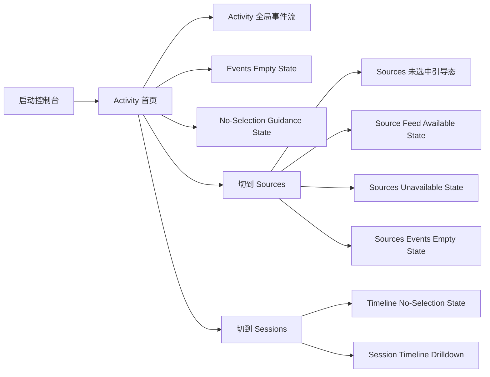
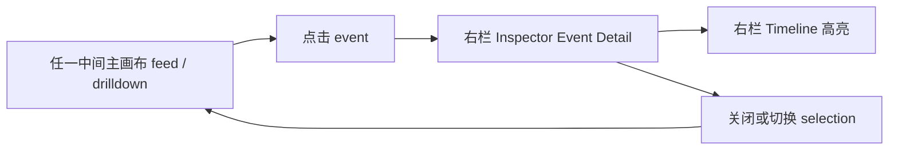
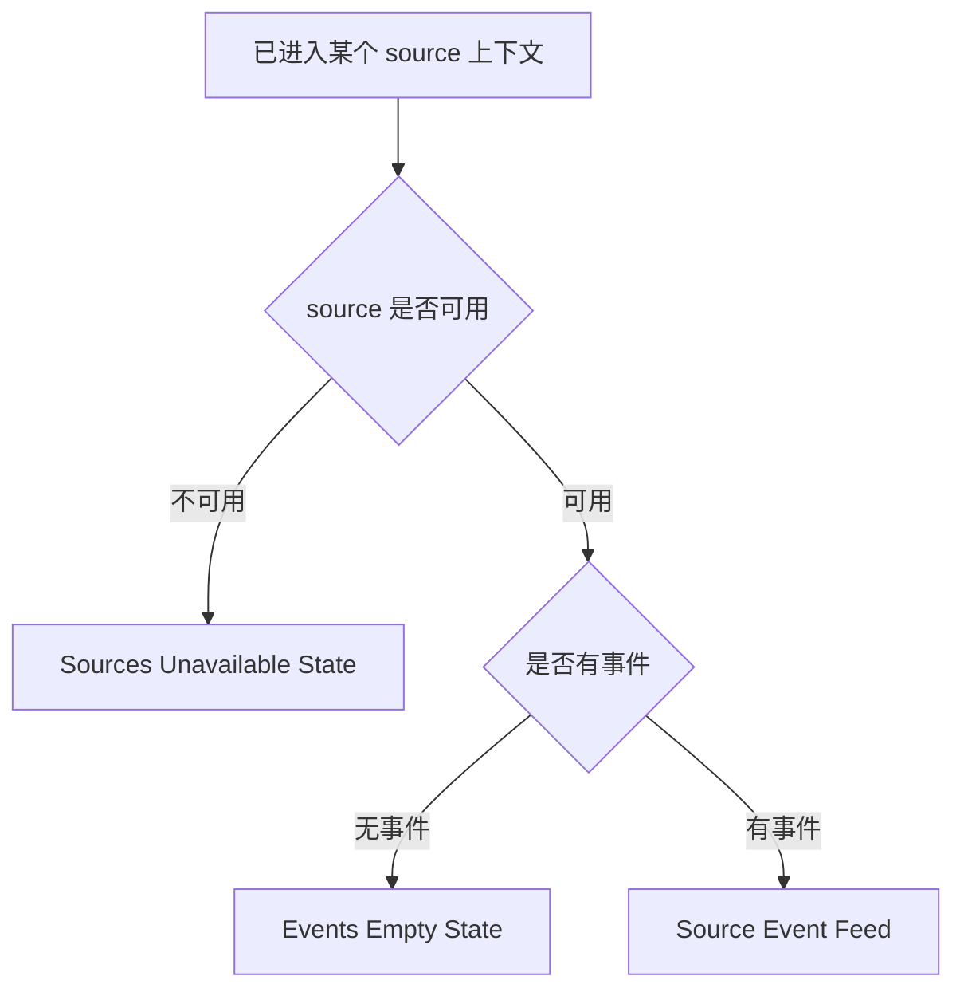
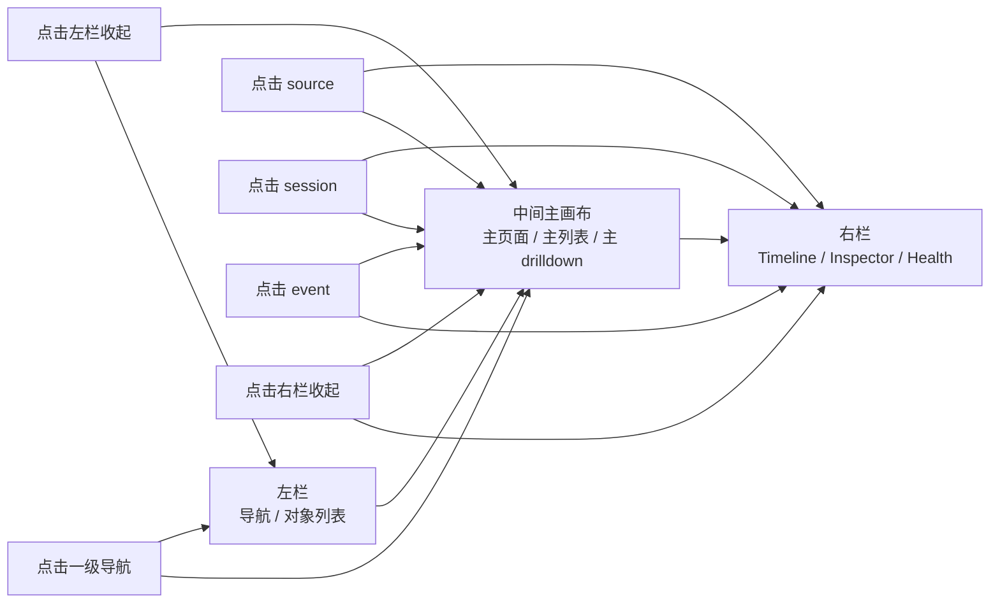
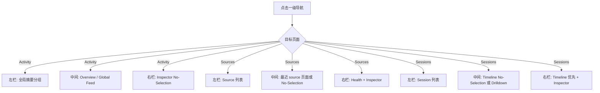
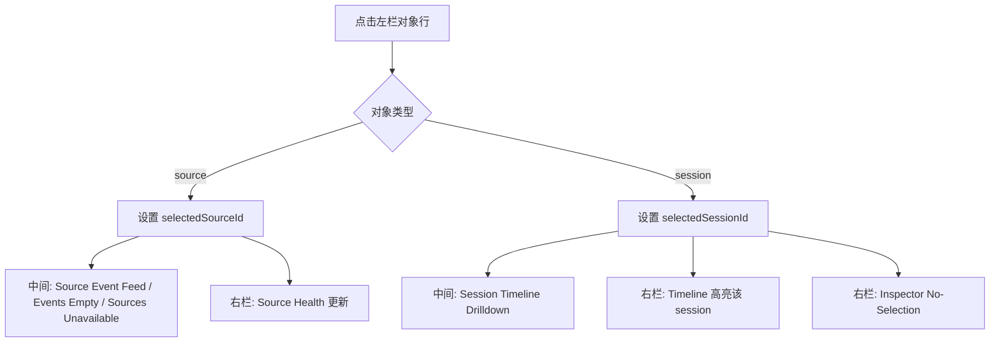
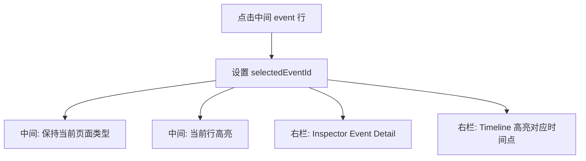
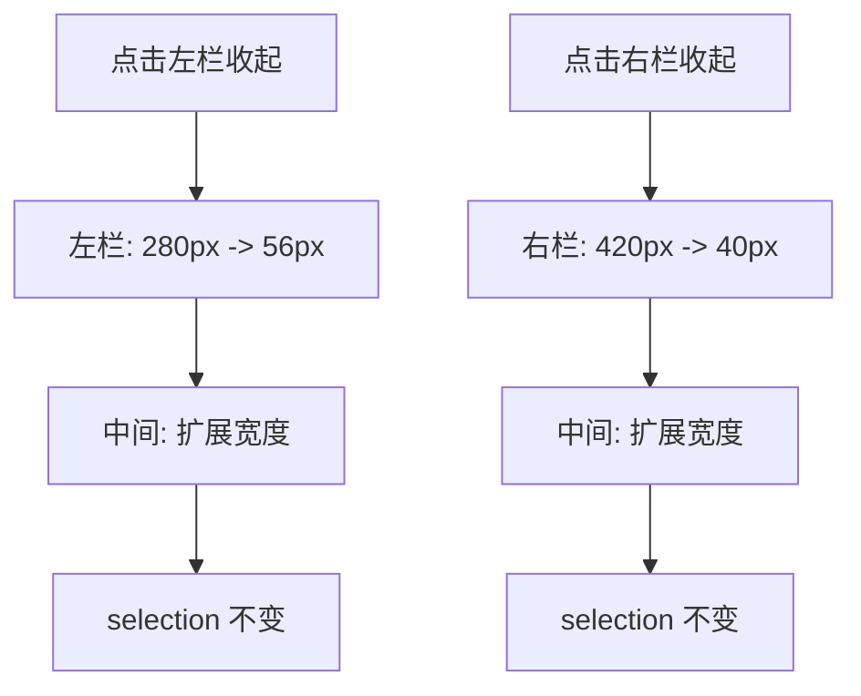

# Codex App Server Observer Console 交互规格

日期：2026-04-26  
状态：进行中，作为 V1 控制台实现依据

## 1. 文档目的

本文件不是补一轮新的视觉稿，而是把现有 `observer-first` 设计稿补成可实现的交互规格。

目标有两层：

1. 给产品与设计评审一个完整的交互说明
2. 给程序员一份可以直接落地的页面流转与状态机口径

本文件适用于：

- `Codex App Server`
- `opencode`
- 后续所有 `observer source`

本文件不覆盖：

- 移动端布局
- 窄屏单栏重排
- attach-first 历史设计

## 2. 全局边界

这一轮默认控制台是：

- `macOS` 桌面应用
- 固定三栏布局
- 左栏与右栏允许收起
- 不单独设计移动端
- 不单独设计窄屏自适应

V1 直接声明一个最小推荐窗口宽度：

- 推荐宽度：`>= 1440px`
- `1280px - 1439px`：允许使用，但信息密度下降
- `< 1280px`：不作为 V1 设计目标

### 2.1 壳层一致性硬约束

这一轮最重要的设计约束不是“多出几张状态页”，而是：

`所有页面共用同一套应用壳层，变化只能发生在中间主画布。`

当前唯一指定的壳层基准页是：

- [prismtrace_活动首页_中文版_白色版/code.html](/Volumes/MacData/workspace/PrismTrace/html/stitch_prismtrace_console_redesign_explorations/prismtrace_活动首页_中文版_白色版/code.html)

后续所有页面都应视为：

- 复用这张基准页的顶部栏
- 复用这张基准页的左栏
- 复用这张基准页的右栏
- 只替换中间主画布内容

这条约束是非可选项，必须同时约束设计稿和实现。

具体要求如下：

- 顶部栏基础结构固定不变
- 左栏基础结构固定不变
- 右栏基础结构固定不变
- 中间主画布根据状态切换页面

不允许出现下面这些情况：

- 首页一个顶栏，`Sources` 页面又换一套顶栏
- 某个状态页把右上角全局控件位置改掉
- 某个状态页把左栏改成完全不同的导航模型
- 某个状态页把右栏模块顺序、命名、骨架全部换掉

V1 可以变化的只有两类东西：

1. 中间主画布的页面内容
2. 左右栏在相同骨架下的选中态、空态、摘要态、详情态

换句话说，程序员应把控制台实现成：

- 一个固定 `App Shell`
- 多个中间主画布页面
- 一个固定右栏容器里的不同子态

而不是：

- 每张设计稿都像一套新页面模板

## 3. 首页与页面命名

### 3.1 默认首页

控制台默认首页明确为：

- `Activity`

首页对应的设计语义是：

- 统一 observer 总览
- 跨 source 的事件流入口
- 带全局 `Theme / Language` 控件

设计稿上，首页对应这两张：

- 深色默认首页：`PrismTrace Observer Console Overview - Dark with Global Theme and Language Controls`
- 白色主题首页：`PrismTrace Observer Console Overview - Light with Global Theme and Language Controls`

### 3.2 一级导航

左栏一级导航固定为：

- `Activity`
- `Sources`
- `Sessions`

其中：

- `Activity` 是默认 landing page，也是全局运行态总览
- `Sources` 是按 source 查看的页面族
- `Sessions` 是按 session 查看的页面族

`Events`、`Timeline`、`Inspector`、`Observability Health` 不是一级导航，它们是页面内部区域或辅助面板。

## 4. 布局职责

### 4.0 固定壳层定义

为了让实现不再猜，这里直接定义“哪些东西是固定壳层”。

固定壳层不是抽象概念，而是以上述基准页为准进行实现和评审。

以下元素在所有页面中都必须保持同一位置、同一层级、同一命名：

- 顶部左侧品牌区
- 顶部中部的全局检索/标题区
- 顶部右侧 `Theme / Language` 全局控件
- 左栏一级导航：`Activity / Sources / Sessions`
- 右栏三块模块容器：`Timeline / Inspector / Observability Health`

允许变化的是：

- 顶部中部的当前页面标题或筛选摘要
- 左栏对象列表内容
- 右栏模块里的数据、空态、详情态
- 中间主画布的完整页面内容

不允许变化的是：

- 顶栏左右分区位置
- 左栏一级导航顺序
- 右栏模块的大结构
- 全局控件在不同页面中的摆放方式

如果某张设计稿与基准页在这些位置上不一致，应视为该设计稿需要回炉，而不是让程序员按页特判。

### 4.1 左栏

左栏负责：

- 一级导航切换
- 当前导航上下文下的对象列表
- 快速筛选与计数

左栏不负责：

- 展示主内容详情
- 承载完整 event detail
- 承载主时间线页面

### 4.2 中间主画布

中间主画布负责：

- 当前一级导航对应的主页面
- 当前上下文下的主列表或主 drilldown
- 空态、无选择态、异常态

中间主画布是唯一主内容区。所有“当前用户正在看的页面”都必须落在这里。

### 4.3 右栏

右栏只负责辅助信息：

- `Timeline`
- `Inspector`
- `Observability Health`

右栏不能抢主叙事。右栏内容变化不应改变中间主画布页面类型。

## 5. 栏位尺寸与收起规则

### 5.1 默认尺寸

桌面默认尺寸建议固定为：

- 左栏展开：`280px`
- 中间主画布：自适应，最小 `720px`
- 右栏展开：`420px`

### 5.2 左栏收起

左栏允许收起。

收起后规则：

- 宽度收为 `56px`
- 仅保留一级导航图标与 tooltip
- 当前对象列表隐藏
- 中间主画布扩展占用剩余空间

左栏收起不会改变当前页面状态，只改变空间分配。

### 5.3 右栏收起

右栏允许收起。

收起后规则：

- 宽度收为 `40px`
- 保留一条竖向展开手柄
- `Timeline / Inspector / Health` 内容全部隐藏
- 中间主画布扩展占用剩余空间

右栏收起不会清空当前选中态，重新展开后恢复原状态。

### 5.4 状态持久化

以下 UI 状态在 V1 中本地持久化：

- `theme`
- `language`
- `leftSidebarCollapsed`
- `rightSidebarCollapsed`
- 最近一次 `primaryView`

以下状态不持久化：

- `selectedEventId`
- `selectedSessionId`
- 临时过滤条件

## 6. 全局壳层控件

顶部右侧固定放两组全局控件：

- `Theme`: `Light | Dark`
- `Language`: `中文 | EN`

规则如下：

- `Theme` 切换只改变视觉 token，不改变数据和页面结构
- `Language` 切换只改变 UI 文案，不翻译 `raw_json` 或原始 event payload
- 两个控件对整个控制台立即生效
- 它们不属于某一个页面，也不跟随 `Activity / Sources / Sessions` 切换重置

## 7. 选择模型

控制台实现必须显式维护三类选择态：

- `selectedSourceId`
- `selectedSessionId`
- `selectedEventId`

还必须显式维护一个一级页面状态：

- `primaryView = activity | sources | sessions`

### 7.1 选择优先级

优先级从大到小为：

1. `primaryView`
2. `selectedSourceId` 或 `selectedSessionId`
3. `selectedEventId`

解释：

- 一级导航决定中间主画布要显示哪一类页面
- source / session 选择决定当前页面上下文
- event 选择只影响右栏 detail，不应替换主画布页面

### 7.2 选择联动规则

- 选中 `source` 时，可以清空与之无关的 `selectedSessionId`
- 选中 `session` 时，应清空 `selectedSourceId` 的主导作用，但允许通过 session 反查 source 信息
- 选中 `event` 时，不切换一级导航
- `event` 归属变化时，如果当前选中 event 不再存在，应自动清空 `selectedEventId`

## 8. 一级导航与页面流转

### 8.1 Activity

`Activity` 是默认首页。

进入 `Activity` 后：

- 左栏显示跨 source 的摘要分组
- 中间主画布显示全局 observer feed
- 右栏默认显示 `Inspector No-Selection`

`Activity` 下不要求先选 source 或 session 才能看内容。

`Activity` 的中间主画布有三种主态：

- 有事件：显示全局事件流总览
- 无事件：显示 `Events Empty State`
- 数据未准备好但需要用户先操作：显示 `No-Selection Guidance State`

### 8.2 Sources

进入 `Sources` 后：

- 左栏切换为 source 列表
- 中间主画布显示 source 上下文页面
- 右栏显示 source health + inspector 辅助信息

`Sources` 的主画布流转规则：

- 未选 source：显示通用 `No-Selection Guidance State`
- 选中可用 source：显示 source-scoped event feed
- 选中 unavailable source：显示 `Sources Unavailable State`
- 选中可用 source 但无事件：显示 `Events Empty State`

### 8.3 Sessions

进入 `Sessions` 后：

- 左栏切换为 session 列表
- 中间主画布进入 session 页面族
- 右栏顶部优先显示 timeline 辅助信息

`Sessions` 的主画布流转规则：

- 未选 session：显示 `Timeline No-Selection State`
- 选中 session：显示 `Session Timeline Drilldown`

`Sessions` 页面里，中间主画布是主时间线，右栏只是补充，不重复承载一整份主时间线。

### 8.4 页面链路总览

这一节专门回答“页面之间到底怎么串起来”。

V1 的页面链路必须按下面这条主线理解：

1. 用户先进入默认首页 `Activity`
2. 再从 `Activity / Sources / Sessions` 三个一级视角中选择一个观察角度
3. 再通过左栏对象列表把中间主画布切到具体上下文
4. 最后通过 event selection 驱动右栏 detail

也就是说，页面切换优先级固定为：

`一级导航 -> 中间主画布页面 -> 右栏 detail`

不能反过来理解成：

`先点 event 看 detail -> 再决定主页面是什么`

#### A. 一级页面链路



#### B. detail 链路



#### C. 异常与空态链路



### 8.5 页面进入与退出规则

为了避免实现时“页面停在不该停的地方”，每个主页面都要有明确的进入条件和退出条件。

| 页面 | 进入条件 | 退出条件 |
| --- | --- | --- |
| `Activity 首页` | 启动控制台；或点击一级导航 `Activity` | 点击一级导航 `Sources` 或 `Sessions` |
| `Activity 全局事件流` | `Activity` 下存在可展示事件 | 事件为空；或切换一级导航 |
| `Source Feed Available` | `primaryView = sources` 且存在 `selectedSourceId` 且 source healthy 且有事件 | source 变 unavailable；事件清空；切换一级导航；换 source |
| `Sources Unavailable State` | `primaryView = sources` 且当前 source unavailable / degraded 到不可用级别 | source 恢复；切换 source；切换一级导航 |
| `Timeline No-Selection State` | `primaryView = sessions` 且没有 `selectedSessionId` | 选中某个 session；切换一级导航 |
| `Session Timeline Drilldown` | `primaryView = sessions` 且存在 `selectedSessionId` | 清空 session selection；切换一级导航；切换到另一 session |
| `Inspector Event Detail` | 任一 feed/drilldown 下存在 `selectedEventId` | 清空 event selection；event 消失；切换到不包含该 event 的上下文 |

### 8.6 从首页出发的典型链路

下面这些链路是实现和联调时最常用的“标准走法”。

#### 链路 1：启动后查看全局活动

```text
启动控制台
-> Activity 首页
-> Activity 全局事件流
-> 点击某条 event
-> 右栏 Inspector Event Detail
```

结果要求：

- 中间主画布始终停在 `Activity` 全局事件流
- 右栏切到 detail
- 不自动跳到 `Sources` 或 `Sessions`

#### 链路 2：从首页切到某个来源

```text
Activity 首页
-> 点击一级导航 Sources
-> Sources 未选中引导态 或 最近一次 source 页面
-> 点击左栏某个 source
-> Source Feed Available 或 Sources Unavailable
```

结果要求：

- 左栏高亮当前 source
- 中间主画布切成 source-scoped 页面
- 右栏 health 跟 source 上下文更新

#### 链路 3：从首页切到某个会话

```text
Activity 首页
-> 点击一级导航 Sessions
-> Timeline No-Selection State
-> 点击左栏某个 session
-> Session Timeline Drilldown
-> 点击中间某条 event
-> 右栏 Inspector Event Detail
```

结果要求：

- 中间主画布先进入 `Timeline No-Selection`
- 选中 session 后再切到 drilldown
- 点 event 后只开右栏 detail，不替换中间主画布

#### 链路 4：从异常态恢复

```text
Sources Unavailable State
-> 点击 Retry Connection 或恢复 source
-> Source Health 更新
-> 若恢复成功且有事件，进入 Source Feed Available
-> 若恢复成功但无事件，进入 Events Empty State
```

结果要求：

- 恢复动作先影响当前 source 上下文
- 不应直接把用户送回 `Activity`
- 失败时继续留在当前异常页，并刷新 health/diagnosis

### 8.7 返回与保留规则

页面链路还需要明确“返回时保留什么”。

#### A. 从 `Sources` 返回 `Activity`

- 保留最近一次 `selectedSourceId` 作为 `Sources` 的返回点
- 清空 `selectedSessionId`
- `Activity` 只保留当前仍可见的 `selectedEventId`

#### B. 从 `Sessions` 返回 `Activity`

- 保留最近一次 `selectedSessionId` 作为 `Sessions` 的返回点
- 清空 `selectedSourceId` 的主导作用
- 如果当前 event 不再属于 `Activity` 可见集合，则清空 `selectedEventId`

#### C. 在同一页面族内切对象

- 换 source：保留 `primaryView = sources`，切换中间主画布上下文
- 换 session：保留 `primaryView = sessions`，切换中间 drilldown 上下文
- 换 event：只更新右栏 detail 与中间选中态

#### D. 收起侧栏

- 不是页面跳转
- 不能清空 selection
- 不能改变当前页面族
- 只能改变空间分配

## 9. 点击动作与显示位置

这一节是实现口径的核心。所有点击行为必须有明确的“谁变、谁不变”规则。

### 9.0 区域变化原则

V1 的核心原则只有一句：

`重点内容始终在中间主画布，左栏负责导航与列表，右栏负责辅助信息。`

也就是说：

- 点击一级导航，优先变化的是中间主画布
- 点击 `source / session`，优先变化的是中间主画布
- 点击 `event`，优先变化的是右栏 `Inspector`
- 点击左右栏收起按钮，只改变布局，不改变页面语义

可以把整个控制台理解成下面这张总图：



### 9.1 点击一级导航

点击 `Activity / Sources / Sessions`：

- 改变：`primaryView`
- 更新：左栏对象列表、中间主画布页面
- 不直接改变：`theme`、`language`

附加规则：

- 切到 `Activity`：清空 `selectedSessionId`，保留 `selectedEventId` 仅当该 event 仍可见
- 切到 `Sources`：保留最近一次 `selectedSourceId`，如果没有则进入 `No-Selection Guidance`
- 切到 `Sessions`：保留最近一次 `selectedSessionId`，如果没有则进入 `Timeline No-Selection`

### 9.2 点击左栏 source 行

点击 source 行时：

- 设置：`primaryView = sources`
- 设置：`selectedSourceId = clickedSourceId`
- 清空：`selectedSessionId`
- 清空或保留：`selectedEventId`

规则：

- 如果当前 event 不属于该 source，则清空 `selectedEventId`
- 如果当前 event 属于该 source，则允许保留并继续在右栏显示 detail

显示结果：

- 中间主画布切到该 source 的主页面
- 右栏 `Health` 更新为该 source 的健康状态

### 9.3 点击左栏 session 行

点击 session 行时：

- 设置：`primaryView = sessions`
- 设置：`selectedSessionId = clickedSessionId`
- 清空：`selectedEventId`

显示结果：

- 中间主画布切到 `Session Timeline Drilldown`
- 右栏默认显示 `Inspector No-Selection`
- 右栏 `Timeline` 高亮当前 session 的摘要信息

### 9.4 点击中间主画布 event 行

点击 event 行时：

- 设置：`selectedEventId = clickedEventId`
- 不改变：`primaryView`
- 不改变：当前主画布页面类型

显示结果：

- 右栏 `Inspector` 切到 `Event Detail`
- 如果 event 关联 session，右栏 `Timeline` 高亮对应时间点
- 中间主画布保持原页面，只更新当前行选中态

### 9.5 点击右栏 timeline 节点

点击右栏 timeline 节点时：

- 如果节点映射到 event，则设置 `selectedEventId`
- 如果节点映射到 session 且当前不在 `Sessions` 页面，可选跳转到 `Sessions`

V1 推荐规则：

- 在 `Activity / Sources` 中点击 timeline 节点，只做 event 选中与主画布滚动定位
- 在 `Sessions` 中点击 timeline 节点，选中 event 并保持当前 drilldown 页面

### 9.6 点击 health 告警项

点击 health 告警项时：

- 如果告警归属某个 source，则切到 `Sources` 并选中该 source
- 如果告警归属全局 observer，则留在当前页，仅在右栏展开 health 详情

### 9.7 点击空态操作按钮

空态页允许出现 CTA，但 CTA 只能做以下几类动作：

- 切换一级导航
- 聚焦某个 source
- 清空筛选条件
- 打开帮助文档或说明

CTA 不应该直接制造隐式 selection。

### 9.8 关键点击矩阵

下面这张表是给实现直接用的“点击后各区域变化表”。

| 点击对象 | 左栏变化 | 中间主画布变化 | 右栏变化 |
| --- | --- | --- | --- |
| `Activity` 一级导航 | 切为全局摘要分组 | 切到 `Activity Overview / Global Event Feed` 或空态 | 保持当前辅助块结构，默认 `Inspector No-Selection` |
| `Sources` 一级导航 | 切为 source 列表 | 若已有最近 source，则进入对应 source 页；否则进 `No-Selection Guidance` | 更新为 source 相关辅助信息 |
| `Sessions` 一级导航 | 切为 session 列表 | 若已有最近 session，则进 `Session Timeline Drilldown`；否则进 `Timeline No-Selection` | `Timeline` 提升为优先块 |
| 左栏 source 行 | 高亮该 source | 切到该 source 的主页面，可能是 feed / empty / unavailable | `Health` 切到该 source；`Inspector` 保留或清空 event detail |
| 左栏 session 行 | 高亮该 session | 切到 `Session Timeline Drilldown` | `Timeline` 高亮该 session；`Inspector` 置为 no-selection |
| 中间 event 行 | 左栏不变 | 保持原页面，只更新行选中态与滚动定位 | `Inspector` 切到 detail；`Timeline` 高亮对应节点 |
| 右栏 timeline 节点 | 左栏通常不变 | 尝试滚动并高亮对应 event；在 `Sessions` 中保持当前 drilldown | `Inspector` 切到对应 event detail |
| 右栏 health 告警 | 若归属 source，则切换并高亮该 source | 若归属 source，则切到 source 异常页；若是全局告警，则主画布不变 | 展开 health detail |
| 左栏收起按钮 | 左栏收起为图标态 | 主画布横向扩展 | 右栏不变 |
| 右栏收起按钮 | 左栏不变 | 主画布横向扩展 | 右栏收起为手柄态 |

### 9.9 关键操作流转图

下面几张图专门回答“点哪个按钮，哪个区域显示什么”。

#### A. 点击一级导航



#### B. 点击左栏 source / session



#### C. 点击中间 event



#### D. 点击收起按钮



### 9.10 中间主画布优先级

为了避免实现时又把主内容挤去右栏，V1 要明确中间主画布的优先级：

1. 一级导航切换后，中间主画布必须先切页面族
2. source / session 选择后，中间主画布必须先切主态
3. event 选择不能把中间主画布替换成 detail
4. 只有右栏内容可以因为 event selection 切到 detail

如果实现时出现“点击后只有右栏变，中间主画布没切”的情况，应视为不符合本规格。

## 10. 中间主画布状态机

### 10.1 Activity 主画布

| 条件 | 中间主画布 |
| --- | --- |
| 有可展示事件 | `Activity Overview / Global Event Feed` |
| 没有任何事件 | `Events Empty State` |
| 数据尚未就绪且需要用户先切换上下文 | `No-Selection Guidance State` |

### 10.2 Sources 主画布

| 条件 | 中间主画布 |
| --- | --- |
| 未选 source | `No-Selection Guidance State` |
| source unavailable / degraded 到不可用级别 | `Sources Unavailable State` |
| source 可用但无事件 | `Events Empty State` |
| source 可用且有事件 | `Source Event Feed` |

### 10.3 Sessions 主画布

| 条件 | 中间主画布 |
| --- | --- |
| 未选 session | `Timeline No-Selection State` |
| 已选 session | `Session Timeline Drilldown` |

## 11. 右栏状态机

右栏始终包含三个辅助模块：

- `Timeline`
- `Inspector`
- `Observability Health`

V1 推荐采用“同栏分块 + 条件展开”：

- `Inspector` 默认展开
- `Timeline` 在 `Sessions` 页面默认展开
- `Health` 默认折叠为摘要，异常时自动展开

### 11.1 Inspector

| 条件 | Inspector |
| --- | --- |
| 未选 event | `Inspector No-Selection State` |
| 已选 event | `Inspector Event Detail State` |

### 11.2 Timeline

| 条件 | Timeline |
| --- | --- |
| `primaryView = sessions` 且未选 session | 展示 session 引导摘要 |
| `primaryView = sessions` 且已选 session | 展示当前 session 时间线摘要 |
| 其他页面且 event 关联 session | 展示该 event 所在 session 的压缩时间线 |
| 没有关联 session | 展示占位说明或折叠 |

### 11.3 Observability Health

| 条件 | Health |
| --- | --- |
| 所有 source 正常 | 展示简要健康摘要 |
| 某 source degraded | 展示 degraded 摘要并可跳转到该 source |
| 某 source unavailable | 自动展开，突出不可用告警 |

## 12. Stitch 页面到实现态的映射

当前已出的设计稿应这样映射到实现：

| Stitch 页面 | 实现语义 |
| --- | --- |
| `PrismTrace Observer Console Overview - Dark with Global Theme and Language Controls` | 默认首页，`Activity` 深色主题 |
| `PrismTrace Observer Console Overview - Light with Global Theme and Language Controls` | 默认首页，`Activity` 白色主题 |
| `PrismTrace Activity Global Feed State` | `Activity` 正常主态，突出中间主画布 |
| `PrismTrace Activity Event Selected State` | `Activity + selectedEventId`，主画布不切页，右栏切 detail |
| `PrismTrace Activity Left Sidebar Collapsed State` | `Activity + leftSidebarCollapsed = true` |
| `PrismTrace Activity Right Sidebar Collapsed State` | `Activity + rightSidebarCollapsed = true` |
| `PrismTrace Source Feed Available State` | `Sources + selectedSourceId + healthy + has events` |
| `PrismTrace Session Timeline Drilldown` | `Sessions + selectedSessionId` |
| `PrismTrace Timeline No-Selection State (Design Review)` | `Sessions + no selectedSessionId` |
| `PrismTrace Sources Unavailable State` | `Sources + selectedSourceId + unavailable` |
| `PrismTrace Observer Console - Degraded Source State` | `Sources + selectedSourceId + degraded` 的视觉参考 |
| `PrismTrace Events Empty State (Design Review)` | 任一主页面的空事件态 |
| `PrismTrace No-Selection Guidance State` | 通用未选择引导态 |
| `PrismTrace Inspector No-Selection State (Design Review)` | `selectedEventId = null` |
| `PrismTrace Inspector Event Detail State` | 深色 detail 态 |
| `PrismTrace Inspector Event Detail State - Light` | 白色 detail 态 |

## 13. 给程序员的最小实现口径

V1 建议在前端状态中至少显式维护这些字段：

```ts
type PrimaryView = "activity" | "sources" | "sessions";

type ConsoleUiState = {
  primaryView: PrimaryView;
  selectedSourceId: string | null;
  selectedSessionId: string | null;
  selectedEventId: string | null;
  leftSidebarCollapsed: boolean;
  rightSidebarCollapsed: boolean;
  theme: "dark" | "light";
  language: "zh-CN" | "en";
};
```

页面决策应遵守两个原则：

1. 先根据 `primaryView` 决定中间主画布页面族
2. 再根据 `selectedSourceId / selectedSessionId / selectedEventId` 决定各区域子态

程序实现上禁止出现以下情况：

- 点击 event 后把主画布替换成 raw JSON detail
- 点击 session 后只在右栏切换，而中间主画布不变
- source 不可用时只在角落给一个 badge，不切换到异常态页面
- 左右栏收起时丢失当前 selection

## 14. 当前仍待补齐的设计细节

虽然本文件已经补上了主交互规格，而且核心主路径的设计稿也已经基本齐了，但还有三类细节后续可以继续深化：

- `Activity Overview / Global Event Feed` 的模块组成和优先级
- 左栏对象列表里的二级筛选、排序、搜索规则
- 右栏 `Timeline / Inspector / Health` 在极高密度数据下的滚动与固定策略

如果继续补稿，优先级建议是：

1. `Sources + selectedEventId` 状态
   - 表达“source 页中点选 event 后，主画布保持 source feed，右栏切 detail”
2. `Sessions + selectedEventId` 状态
   - 表达“session drilldown 中点选 event 后，主画布仍是 session 时间线”
3. `Health Expanded Detail` 状态
   - 表达右栏 health 从摘要展开到诊断详情
4. 左栏对象列表的 `search / filter / sort` 交互态
   - 表达筛选后如何影响中间主画布结果集

但这些都不影响 V1 先按本文件实现基础状态机。
